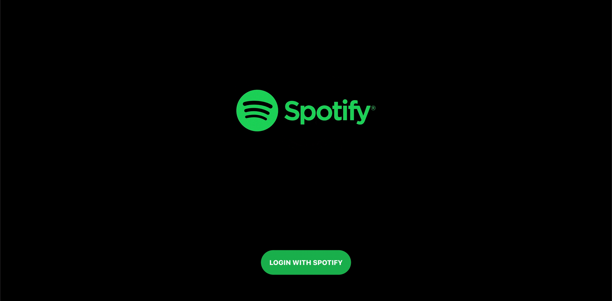

# Spotify Clone   

   

Check Out: https://spotify-devtyagi.netlify.app/

Just a front end clone of the spotify web app, yet another practice project.  

* React Hooks
* React Context APIs
* Spotify Web API
* Material UI
